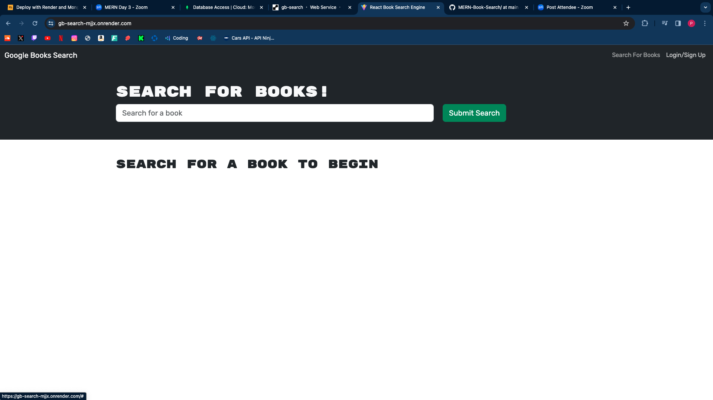
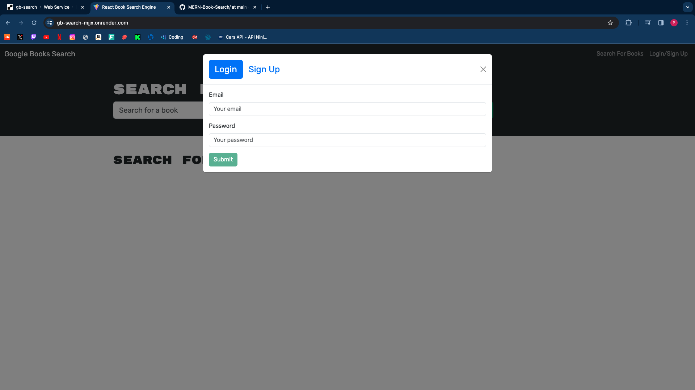
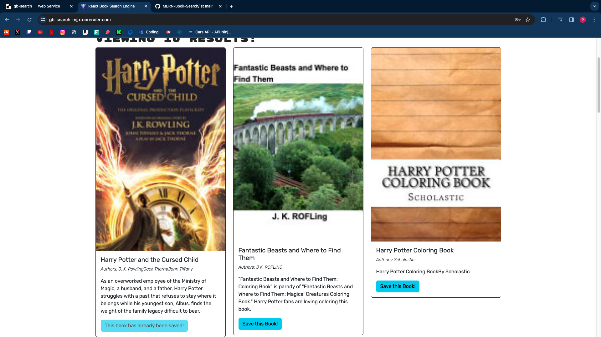
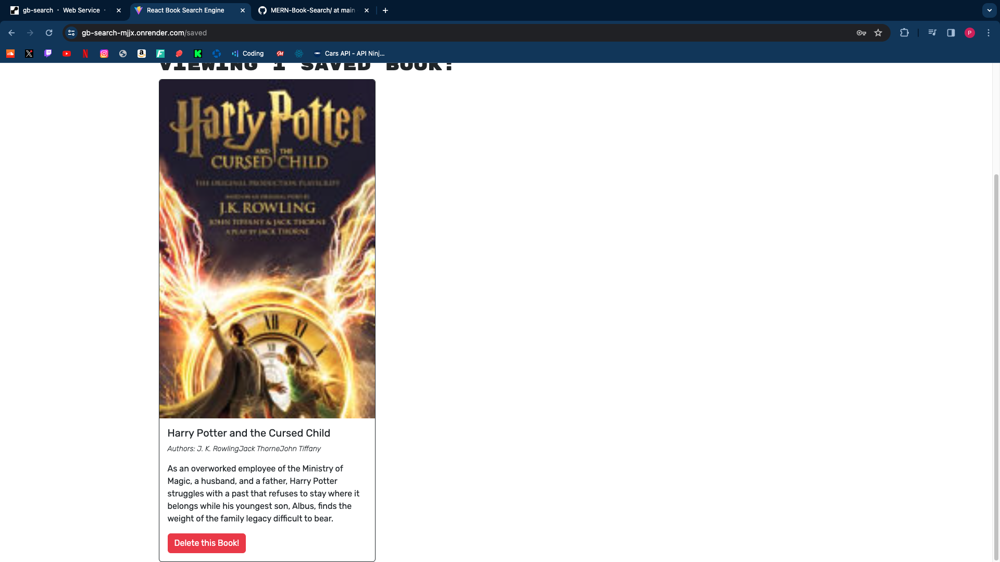

# MERN-Book-Search

## Table of Contents
  • [Description](#description)
  • [Installation](#installation)
  • [Usage](#usage)
  • [Credits](#credits)
  • [License](#license)
  • [Links](#links)

## Description 
The purpose of this project was to display the skills we have learned throughout bootcamp through this project. In this project the MERN stack was shown which consists of MongoDB, Express.js, React.js, and Node.js. My motivation behind this project was to showcase my newly learned skills to potential employers and also showcase my ability to have a deep understanding of how to build a full stack application. The problem that this project solves is that avid readers now have place to search up any books and see what books can be a potential reads in the future by saving the book through their own account. I have learned many things throughout building this project, I have learned how important debugging is in the developer world, also learned how to deploy a full stack application through Render, and one big takeaway is that I have also learned how use many frameworks and make them work seamlessly together.

## Installation 
The steps required to download my project is to first do an npm install. The next step to install this application is to run the script npm run develop in the root folder of this project. All the npm packages should be added since this project was built to work with the Apollo client.

# Usage

Once the user opens up this website then they are presented with a search bar and buttons to sign up and login on the top right. The user can only be able to search books if they are not logged and have not yet signed up to have an account. 

Once the user clicks on the login/signup button on the top right they can create an account if they have not already. Once the user sign up and or logs in then can still be able to search book but now since they have their account then they can save books that they have searched through clicking the button beneath the description of the book they are looking at. At seen in the second image beneath once the user clicks the button to save a book then the book they saved says the book has already been saved.

Once the user clicks on the button to save the books they have wanted then they can see their saved books in the "See Your Books" button that is in the top right when the user is logged in. When they are brought to the page where all their saved books then they are also presented with a delete a book button which lets them remove the book they have previously saved when they no longer need the book saved. 

## Credits
  Piero Rodriguez(Me) https://github.com/Piero9992023

  ## License
  https://opensource.org/licenses/

  ## Links
  Github Link: https://github.com/Piero9992023/MERN-Book-Search

  Deployed Link: https://gb-search-mjjx.onrender.com/

  Note - The deployed Link at times takes a long time to load due render building the app once the link is open